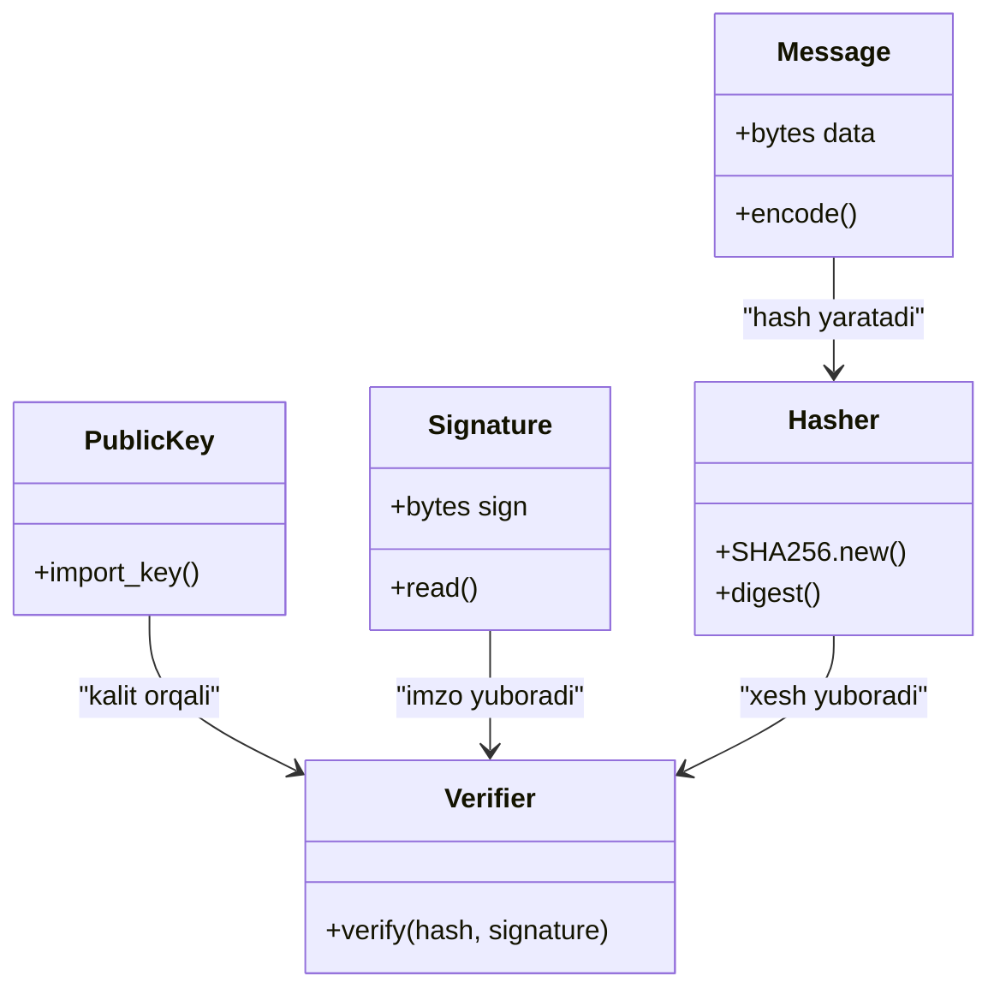

# kiberxavfsizlik



```
classDiagram
    class RSAKeyGenerator {
        +generate_rsa_keypair()
    }

    class RSAKey {
        +generate(2048)
        +export_key()
        +publickey()
    }

    class PrivateKey {
        +bytes data
        +save_to_file()
    }

    class PublicKey {
        +bytes data
        +save_to_file()
    }

    class FileWriter {
        +write(filename, data)
    }

    RSAKeyGenerator --> RSAKey : "generate_rsa_keypair() chaqiradi"
    RSAKey --> PrivateKey : "export_key()"
    RSAKey --> PublicKey : "publickey().export_key()"
    PrivateKey --> FileWriter : "private.pem ga yozadi"
    PublicKey --> FileWriter : "public.pem ga yozadi"
 ```

```
classDiagram
    class Message {
        +bytes data
        +encode()
    }

    class PrivateKey {
        +import_key()
    }

    class Hasher {
        +SHA256.new()
        +digest()
    }

    class Signer {
        +sign(hash)
    }

    class Signature {
        +bytes sign
        +save_to_file()
    }

    class FileWriter {
        +write(filename, data)
    }

    Message --> Hasher : "xabarni xeshlaydi"
    PrivateKey --> Signer : "RSA kaliti bilan imzolash"
    Hasher --> Signer : "hash uzatiladi"
    Signer --> Signature : "signature.sig yaratadi"
    Signature --> FileWriter : "faylga yozadi"
```
